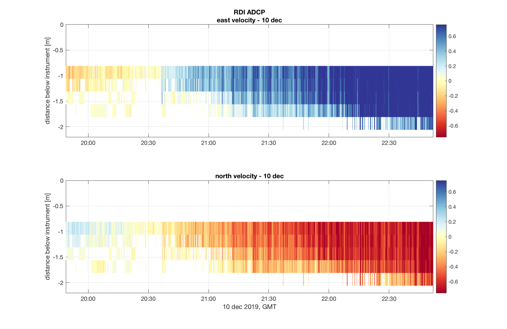
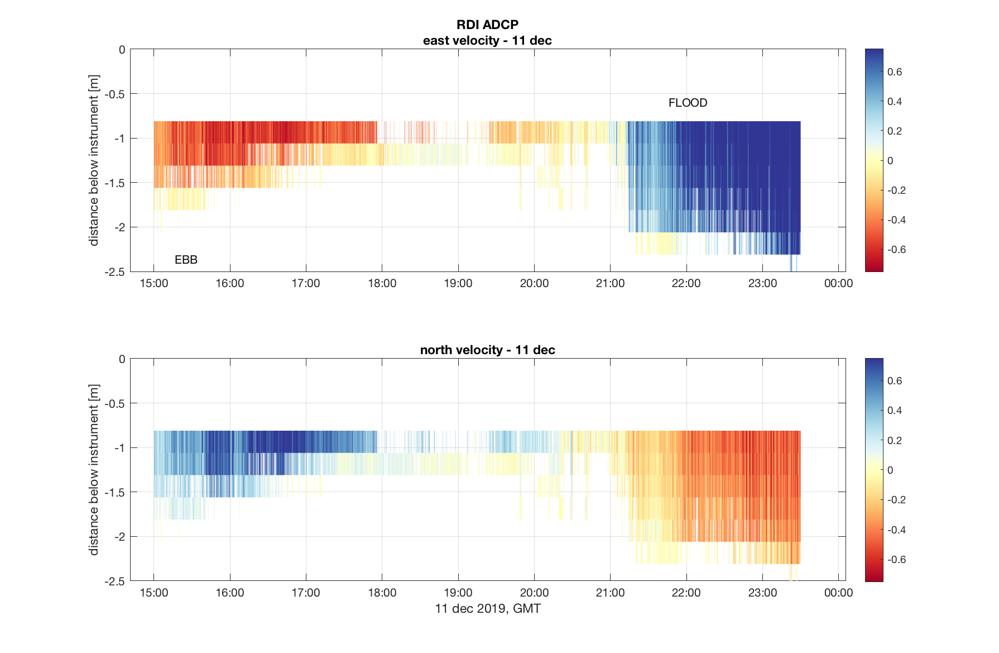
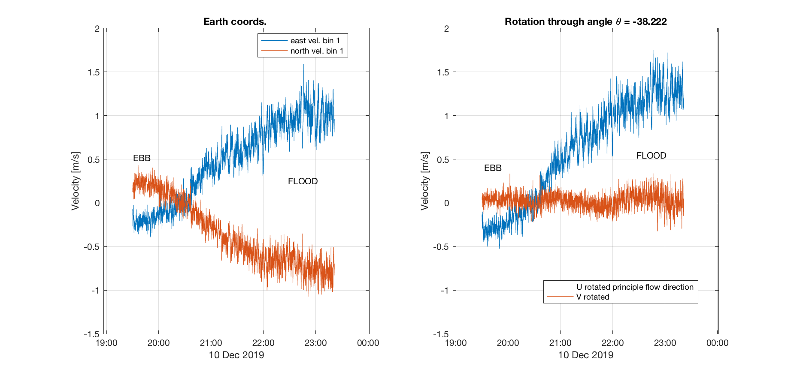
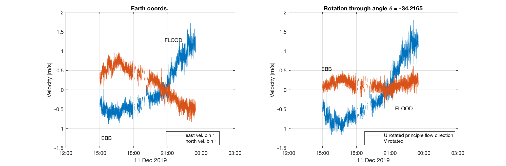

##### 24 November 2020

ADCP (downward facing) processing: 

Script `../scripts/adcp/adcp_06_moving_avg.m` does a 10-second moving average (via a 10 point convolution).

_Previous scripts adcp_01 to adcp_05 do some general plotting, removal of data._

Data (moving avg) are saved as `../edited_data/adcp/adcp_day2_mov_avg10.mat` and `../edited_data/adcp/adcp_day2_mov_avg10.mat` in my directories. These are just the moving average velocities, so the cells, time vector, sensors, etc. need to be loaded from the other files: `../edited_data/adcp/adcp_day1_december_2019_maipo.mat` and `../edited_data/adcp/adcp_day1_december_2019_maipo.mat`

***

Day 1 (10 Dec 2020) - what time was the LTV ADCP in place? (Field notes in google drive don't say). Pressure sensor located approx 16:07 local (19:07 UTC), so probably around then. Cut data before 19:30 on day 1.

The ADCP data in East and North velocities for the two days looks like this. (Note: slightly different depth axis on day 1 than 2). 

Choosing to use only the first bin on each dataset. Rotation into principle flow direction based on bin 1 data only. One rotation for entire dataset: -38 degrees on day 1 and -34 degrees on day 2. Some lateral flow remains in the day 2 data, but ignoring it for now.

